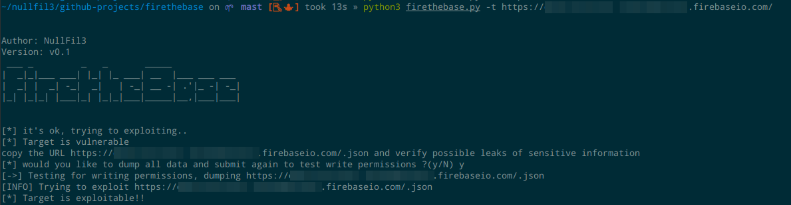
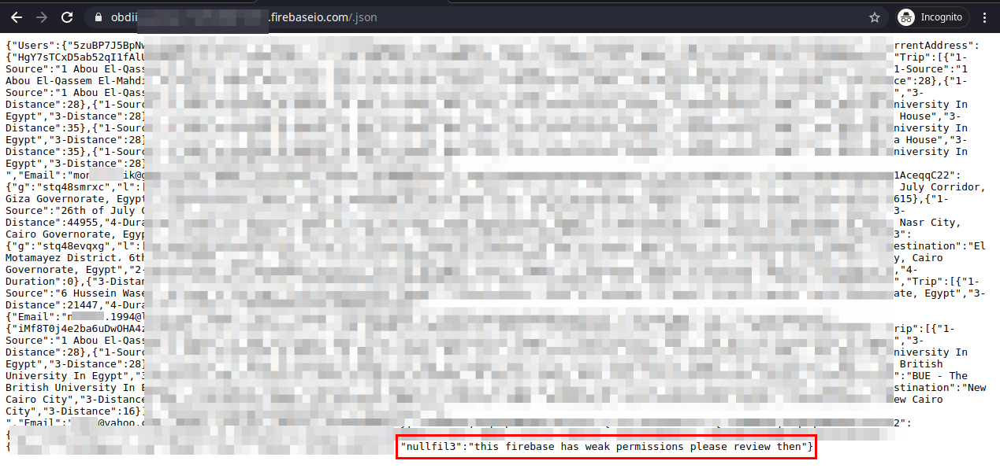

# fireatbase
exploit miss config at firebase instances


# Requirements

```
python3 >= python3.8
Java 8.0 >= Java 11.0
```

# Install
```
#With pipenv
pipenv install -r requirements.txt

#With pip
python3 -m pip install -r requirements.txt --user


# with Pipfile
pipenv install Pipfile
```

# Usage 
```
#Exploit one URL
python3 fire_at_base.py -t https://foo.firebaseio.com

#with apk

--> python3 fire_at_base.py -a com.my.apk
```


´´´
Author: NullFil3
Version: v0.1                                             

 (    (   (                                       (        
 )\ ) )\ ))\ )        (      *   )     (    (     )\ )     
(()/((()/(()/((       )\   ` )  /(   ( )\   )\   (()/((    
 /(_))/(_))(_))\   ((((_)(  ( )(_))  )((_|(((_)(  /(_))\   
(_))_(_))(_))((_)   )\ _ )\(_(_())  ((_)_ )\ _ )\(_))((_)  
| |_ |_ _| _ \ __|  (_)_\(_)_   _|   | _ )(_)_\(_) __| __| 
| __| | ||   / _|    / _ \   | |     | _ \ / _ \ \__ \ _|  
|_|  |___|_|_\___|  /_/ \_\  |_|     |___//_/ \_\|___/___| 
                                                           
Usage:


***********************************************************

usage: firethebase.py [-h] [-t TARGET] [-a APK]

[*] Exploit missconfigured firebase instances

optional arguments:
  -h, --help            show this help message and exit
  -t TARGET, --target TARGET
                        [*] target firebase https://<abc>.firebaseio.com
  -a APK, --apk APK     [*] APK to decompile and search for firebase misconfiguration


************************************************************

´´´


# Images




